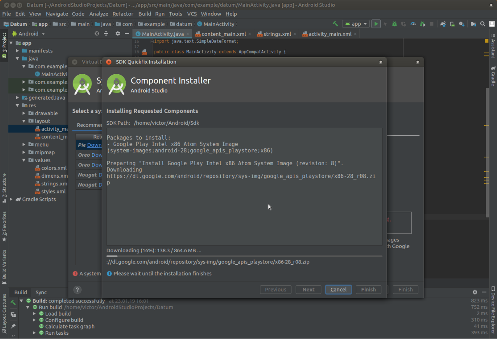

# Simple app to show the current date 
A simple mobile and wear OS application for printing out the current date, using the Android Studio IDE.
### Requirements:
- Java Development Kit (JDK)
	 - Installation: 
		 - Linux: [here](https://openjdk.java.net/install/)
		 - Windows [here](https://www.oracle.com/technetwork/java/javase/downloads/jdk8-downloads-2133151.html)
- Android Studio IDE
	- Installation: 
		- Linux: ```sudo snap install android-studio``` (for 16.04 LTS or later) or [here](https://developer.android.com/studio/#downloads) (for all versions)
		- Windows: [here](https://developer.android.com/studio/#downloads)



## Emulating and testing

For a device emulator, select and download a system image (here tested with Pie).
**Linux:** Before emulating the app, give the current user permission to /dev/kvm (Kernel-based Virtual Machine):
- Login as root with ```sudo -i``` and run ```chown [current_user] /dev/kvm```

